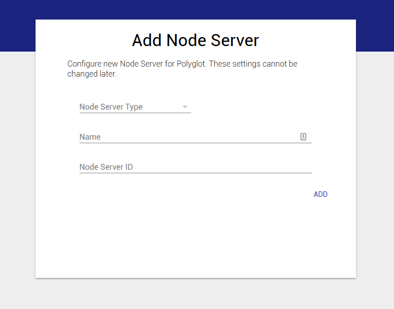
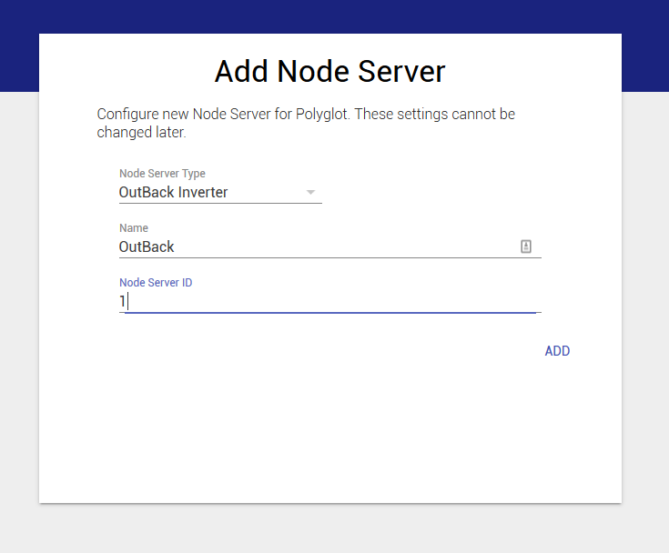
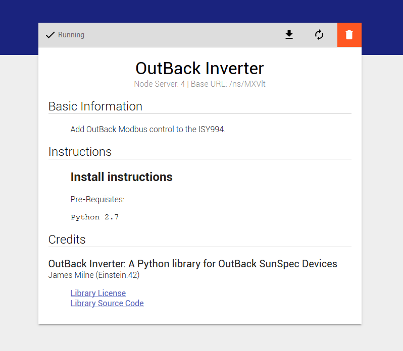
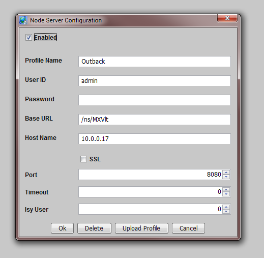

Usage
=====

Installation
~~~~~~~~~~~~

To run the current version you should pull the default branch of outback-inverter. The `github page is here 
<https://github.com/Einstein42/outback-inverter>`_.

.. code-block:: bash

    # Install the pyModbusTCP required package
	sudo pip install pyModbusTCP
	
    # Go to your Polyglot/config/node_servers/ folder
	git clone https://github.com/Einstein42/outback-inverter.git
	
	# Enter the repository directory
	cd outback-inverter
	
	# Edit the file outback-defs.py 
	nano outback-defs.py
	
	# Change lines 5 and 6 as necessary
	# IP Address of the AXS Port device
	# 502 is the standard Modbus Port number
	DEVICEIP = '10.1.1.3'
	DEVICEPORT = '502'
	
	# Restart Polyglot to recognize the new Node Server type.
	sudo systemctl restart polyglot

Now that Polyglot is restarted. Login to your Polyglot admin page::

    http://<ip address>:8080

Add Node Server
~~~~~~~~~~~~~~~

Click on Add Node Server once you login to your Polyglot admin interface. Select the
OutBack Inverter node server type. Name it something logical... like OutBack, and select
a node server id between 1-10 that is currently unused in both Polyglot and the ISY.

Once the nodeserver is active you will see its status as 'running' in the top left corner. Under 
the name in bold, you will notice the node server number, in this case 4 and the Base URL.
Click the down arrow icon to download the profile.zip to your desktop, which we will import
into the ISY shortly. Copy the Base URL to your clipboard and remember the ID number then 
login to the ISY.

In the ISY click on the **Node Servers** menu option, then configure and finally the ID
number you remembered from the previous step and Network Connection.

Profile name does not have to be the same as the node server name in Polyglot, but it makes
sense to make them match. UserID and Password are the login credentials of the Polyglot 
admin. Base URL we copied from Polyglot in the step above. Host name and port are the
IP and port you used to connect to the Polyglot admin page. Leave SSL unchecked, Timeout 
and Isy User leave at 0.

Click the **Upload Profile** button at the bottom and select the profile.zip that we downloaded
from Polyglot.

Now reboot the ISY by going to *Configuration* > *System* > *Reboot*.

Once the ISY is back up, restart Polyglot.

.. code-block:: bash

    sudo systemctl restart polyglot

You should now see the OutBack devices start populating is the ISY for consumption in programs.